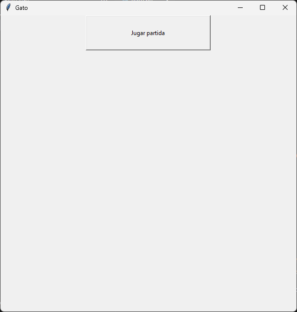
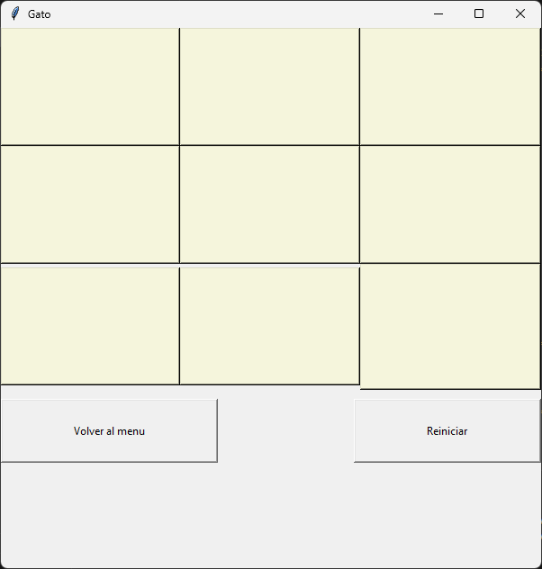
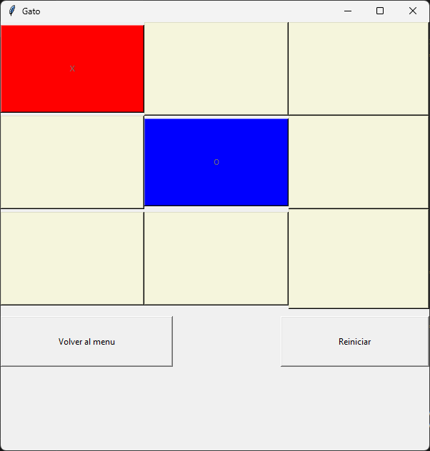

# Gato
## Descripción
Este es un juego de Gato (también conocido como Tic-Tac-Toe) implementado en Python utilizando la librería Tkinter para crear 
la interfaz gráfica de usuario (GUI). El juego permite a dos jugadores competir en el clásico tablero 3x3, donde deben alinear 
tres de sus símbolos, "X" o "O", ya sea en fila, columna o diagonal para ganar.

### Como jugar
1. Seleccionamos el botón "Jugar partida".
   
2. Los jugadores toman turnos seleccionando la casilla que quieren ocupar.
    
    
    
4. El primer jugador que conecte 3 puntos gana, en caso de que nadie logre el objetivo, se toma como un empate.
    
